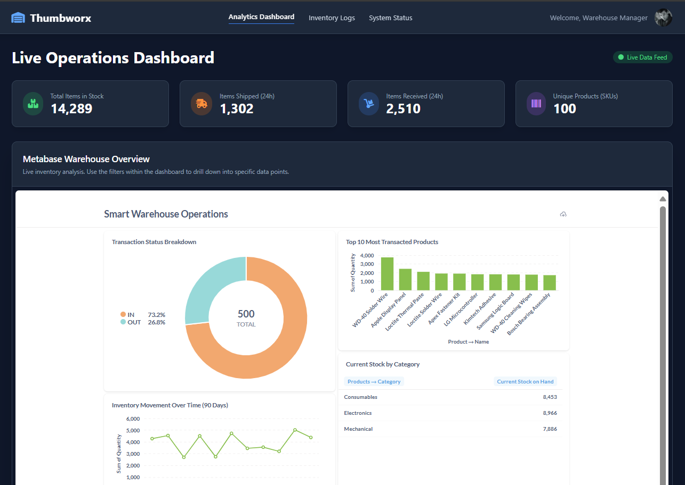
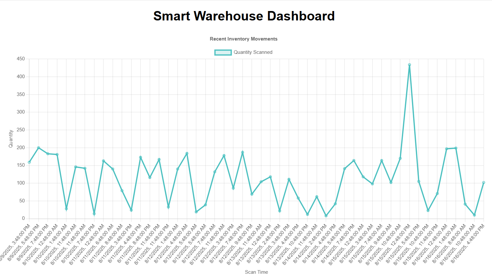

# Technical Documentation: Smart Warehouse System

**Version:** 1.0.0
**Author:** Kiefer

This document provides a detailed technical overview of the Smart Warehouse & Inventory Management System, including its architecture, components, and setup procedures. It is intended for developers and system administrators responsible for maintaining or extending the application.

---

### Application Previews





---
## Table of Contents

1.  System Overview & Architecture
2.  Containerization Environment (Docker)
3.  Database Layer (PostgreSQL)
4.  Scan Processing Service (Flask API)
5.  Web Application (Laravel & Nginx)
6.  Business Intelligence Layer (Metabase)
7.  Data Seeding
8.  Complete Setup & Operational Guide

---

## 1. System Overview & Architecture

This project implements a full-stack, microservices-based system designed to simulate and monitor a smart warehouse environment. The core functionality revolves around processing inventory transactions, storing them in a normalized database, and providing two distinct interfaces for analysis: a live web dashboard and a comprehensive business intelligence platform.

### 1.1. Technology Stack

*   **Backend:** Laravel (PHP 8.2)
*   **Microservice:** Flask (Python 3.9)
*   **Database:** PostgreSQL 14
*   **Frontend:** Laravel Blade with Tailwind CSS
*   **Analytics:** Metabase
*   **Containerization:** Docker & Docker Compose
*   **Web Server:** Nginx

### 1.2. Architecture Diagram

The system is composed of six primary services orchestrated by Docker Compose. The data flow is API-driven, with Nginx acting as the web gateway. The Laravel application serves the main user dashboard and forwards inventory scan requests to the dedicated Flask microservice, which then processes and inserts the data into the PostgreSQL database.

```
                                                     ┌─────────────────┐
                                              ┌─────>│    Metabase     │
                                              │      │ (BI Analytics)  │
                                              │      └─────────────────┘
                                              │               ▲
                                              │               │ SQL
┌───────────────┐      ┌─────────────────┐    │      ┌─────────────────┐
│               │ HTTP │                 │    │      │                 │
│ User's Browser├─────>│      Nginx      │────┼─────>│   PostgreSQL    │
│               │      │   (Web Server)  │    │      │ (Data Storage)  │
└───────────────┘      └─────────────────┘    │      └─────────────────┘
                             │                │               ▲
                             │ PHP-FPM          │               │ SQL (INSERT)
                             ▼                │      ┌─────────────────┐
                       ┌─────────────────┐    │      │                 │
                       │                 │────┘      │    Flask API    │
                       │  Laravel App    │  HTTP POST │ (Scanner Logic) │
                       │ (Web Dashboard) │───────────>└─────────────────┘
                       └─────────────────┘
```
---

## 2. Containerization Environment (Docker)

Docker Compose is the cornerstone of this project, defining and managing the entire multi-container environment for development and deployment consistency.

### 2.1. `docker-compose.yml`

This file is the blueprint for the entire system. It defines each service, its build context, networking, port mapping, environment variables, and volumes for persistent data.

<!-- PASTE YOUR docker-compose.yml CODE HERE -->
```yaml
version: '3.8'

services:
  # 1. Next.js Frontend Service
  frontend:
    build:
      context: ./nextjs-frontend
    container_name: nextjs_frontend
    ports:
      - "3000:3000"
    environment:
      # This tells Next.js where to find the API from within the Docker network
      - NEXT_PUBLIC_API_URL=http://webserver/api
    depends_on:
      - backend
    networks:
      - app-network

  # 2. Laravel Backend Service (PHP-FPM)
  backend:
    build:
      context: ./laravel-backend
      dockerfile: Dockerfile
    container_name: laravel_backend
    volumes:
      - ./laravel-backend:/var/www
    environment:
      - DB_CONNECTION=pgsql
      - DB_HOST=db
      - DB_PORT=5432
      - DB_DATABASE=warehouse
      - DB_USERNAME=postgres
      - DB_PASSWORD=[yourpassword]
      - FLASK_SCANNER_URL=http://scanner:5001/rfid-scan
    depends_on:
      - db
      - scanner
    networks:
      - app-network

  # 3. Nginx Webserver for Laravel
  webserver:
    image: nginx:alpine
    container_name: nginx_webserver
    ports:
      - "8000:80"
    volumes:
      - ./laravel-backend:/var/www
      - ./nginx/default.conf:/etc/nginx/conf.d/default.conf
    depends_on:
      - backend
    networks:
      - app-network

  # 4. Flask Scanner Microservice
  scanner:
    build: ./flask-scanner-service
    container_name: flask_scanner
    ports:
      - "5001:5001"
    environment:
      - DB_HOST=db
      - DB_DATABASE=warehouse
      - DB_USERNAME=postgres
      - DB_PASSWORD=[yourpassword]
    depends_on:
      db:
        condition: service_healthy
    networks:
      - app-network

  # 5. PostgreSQL Database Service
  db:
    image: postgres:14
    container_name: postgres_db
    environment:
      - POSTGRES_DB=warehouse
      - POSTGRES_USER=postgres
      - POSTGRES_PASSWORD=[yourpassword]
    ports:
      - "5432:5432"
    volumes:
      - postgres-data:/var/lib/postgresql/data
    healthcheck:
      test: ["CMD-SHELL", "pg_isready -U postgres -d warehouse"]
      interval: 10s
      timeout: 5s
      retries: 5
    networks:
      - app-network

  # 6. Metabase Service
  metabase:
    image: metabase/metabase:latest
    container_name: metabase_service
    ports:
      - "3030:3000" # Mapped to 3030 to avoid conflict with Next.js
    environment:
      - MB_DB_TYPE=postgres
      - MB_DB_DBNAME=warehouse
      - MB_DB_PORT=5432
      - MB_DB_USER=postgres
      - MB_DB_PASS=[yourpassword]
      - MB_DB_HOST=db
    depends_on:
      db:
        condition: service_healthy
    networks:
      - app-network

networks:
  app-network:
    driver: bridge

volumes:
  postgres-data:
    driver: local

```

---

## 3. Database Layer (PostgreSQL)

PostgreSQL serves as the central data repository. The schema is normalized to realistically model warehouse entities and is managed entirely through Laravel's migration system.

### 3.1. Database Migrations

Instead of a static `.sql` file, the database schema is defined programmatically using Laravel migrations located in `laravel-backend/database/migrations/`. This allows for version control and easy evolution of the database structure.

**Key Migration Files:**
*   `..._create_suppliers_table.php`
*   `..._create_locations_table.php`
*   `..._create_products_table.php`
*   `..._create_inventory_transactions_table.php`
*   `..._create_sessions_table.php`
*   `..._create_cache_table.php`

**Example: `..._create_products_table.php`**
<!-- PASTE YOUR ..._create_products_table.php CODE HERE -->
```php
<?php
use Illuminate\Database\Migrations\Migration;
use Illuminate\Database\Schema\Blueprint;
use Illuminate\Support\Facades\Schema;

return new class extends Migration
{
    public function up(): void
    {
        Schema::create('products', function (Blueprint $table) {
            $table->id();
            $table->string('sku', 50)->unique();
            $table->string('name');
            $table->text('description')->nullable();
            $table->string('category', 100)->nullable();
            $table->string('brand', 100)->nullable();
            $table->decimal('unit_price', 10, 2)->nullable();
            $table->foreignId('supplier_id')->nullable()->constrained('suppliers');
            $table->timestamps();
        });
    }

    public function down(): void
    {
        Schema::dropIfExists('products');
    }
};
```

---

## 4. Scan Processing Service (Flask API)

A standalone Flask application whose sole responsibility is to receive validated scan data from the Laravel backend and insert it into the PostgreSQL database. This decouples the data ingestion logic from the main web application.

### 4.1. Flask Dockerfile (`flask-scanner-service/Dockerfile`)

Defines the environment for the Flask application, installing Python and all necessary packages from `requirements.txt`.

<!-- PASTE YOUR flask-scanner-service/Dockerfile CODE HERE -->
```dockerfile
FROM python:3.9-slim
WORKDIR /app
COPY requirements.txt .
RUN pip install --no-cache-dir -r requirements.txt
COPY . .
EXPOSE 5001
CMD ["gunicorn", "--bind", "0.0.0.0:5001", "app:app"]
```

### 4.2. Python Dependencies (`flask-scanner-service/requirements.txt`)

Lists all Python packages required for the Flask service to run, with versions pinned to ensure compatibility.

<!-- PASTE YOUR flask-scanner-service/requirements.txt CODE HERE -->
```txt
Flask==2.1.2
Werkzeug==2.3.8  # <-- CORRECTED VERSION
psycopg2-binary==2.9.3
gunicorn==20.1.0
```

### 4.3. Flask Application Logic (`flask-scanner-service/app.py`)

This is the core of the service. It defines a single endpoint `/rfid-scan` that accepts JSON data, connects to the database using environment variables, and executes an `INSERT` statement.

<!-- PASTE YOUR flask-scanner-service/app.py CODE HERE -->
```python
from flask import Flask, request, jsonify
from datetime import datetime
import psycopg2
import os

app = Flask(__name__)

def get_db_connection():
    """Establishes a connection to the database using environment variables."""
    conn = psycopg2.connect(
        dbname=os.environ.get("DB_DATABASE"),
        user=os.environ.get("DB_USERNAME"),
        password=os.environ.get("DB_PASSWORD"),
        host=os.environ.get("DB_HOST"),
        port=os.environ.get("DB_PORT", "5432")
    )
    return conn

@app.route('/rfid-scan', methods=['POST'])
def scan_barcode():
    """Handles incoming scan data and inserts it into the database."""
    data = request.json
    if not all(k in data for k in ['sku', 'product_name', 'quantity', 'status']):
        return jsonify({"error": "Missing required fields"}), 400

    try:
        conn = get_db_connection()
        with conn.cursor() as cur:
            cur.execute(
                """
                INSERT INTO inventory (sku, product_name, quantity, last_scanned, status)
                VALUES (%s, %s, %s, %s, %s)
                """,
                (data['sku'], data['product_name'], data['quantity'], datetime.now(), data['status'])
            )
        conn.commit()
        return jsonify({"message": "Scan recorded successfully"}), 201
    except (Exception, psycopg2.DatabaseError) as error:
        print(error)
        return jsonify({"error": "Database operation failed"}), 500
    finally:
        if conn:
            conn.close()

if __name__ == '__main__':
    app.run(host='0.0.0.0', port=5001) 
```

---

## 5. Web Application (Laravel & Nginx)

The primary user-facing component of the system, providing the web dashboard and API endpoints.

### 5.1. Nginx Configuration (`nginx/default.conf`)

Nginx acts as the public-facing web server and reverse proxy. It serves static assets and forwards PHP requests to the `backend` (PHP-FPM) service.

<!-- PASTE YOUR nginx/default.conf CODE HERE -->
```nginx
 server {
    listen 80;
    server_name localhost;
    root /var/www/public;

    add_header X-Frame-Options "SAMEORIGIN";
    add_header X-Content-Type-Options "nosniff";

    index index.php;

    charset utf-8;

    location / {
        try_files $uri $uri/ /index.php?$query_string;
    }

    location = /favicon.ico { access_log off; log_not_found off; }
    location = /robots.txt  { access_log off; log_not_found off; }

    error_page 404 /index.php;

    location ~ \.php$ {
        fastcgi_pass backend:9000; # 'backend' is the name of the laravel service in docker-compose
        fastcgi_param SCRIPT_FILENAME $realpath_root$fastcgi_script_name;
        include fastcgi_params;
    }

    location ~ /\.(?!well-known).* {
        deny all;
    }
}
```

### 5.2. Laravel Dockerfile (`laravel-backend/Dockerfile`)

Defines the PHP 8.2 environment for the Laravel application, installing necessary PHP extensions and system libraries.

<!-- PASTE YOUR laravel-backend/Dockerfile CODE HERE -->
```dockerfile
# File: laravel-backend/Dockerfile
FROM php:8.2-fpm

WORKDIR /var/www

# Install system dependencies
RUN apt-get update && apt-get install -y \
    build-essential \
    libpng-dev \
    libjpeg62-turbo-dev \
    libfreetype6-dev \
    libzip-dev \
    libpq-dev \
    libxml2-dev \
    libonig-dev \
    git \
    curl \
    unzip

# Clear cache
RUN apt-get clean && rm -rf /var/lib/apt/lists/*

# Install PHP extensions
RUN docker-php-ext-install pdo pdo_pgsql mbstring exif pcntl bcmath xml ctype fileinfo zip

# Install GD for image processing
RUN docker-php-ext-configure gd --with-freetype --with-jpeg && docker-php-ext-install gd

# Install Composer
COPY --from=composer:latest /usr/bin/composer /usr/bin/composer

# Copy application code
COPY . .

# Install composer dependencies
RUN composer install --no-interaction --no-plugins --no-scripts --prefer-dist

# Set permissions
RUN chown -R www-data:www-data /var/www/storage /var/www/bootstrap/cache

# Expose port 9000 for PHP-FPM
EXPOSE 9000
CMD ["php-fpm"]
```

### 5.3. Routing (`routes/web.php` and `routes/api.php`)

Defines the web and API routes for the application.
-   `web.php` contains the `/dashboard` route for the user-facing view.
-   `api.php` contains the `/inventory` routes for fetching data and receiving scan POST requests.

**`routes/web.php`:**
<!-- PASTE YOUR laravel-backend/routes/web.php CODE HERE -->
```php
<?php

use Illuminate\Support\Facades\Route;
use App\Http\Controllers\DashboardController;

Route::get('/', function () {
    return view('welcome');
});

Route::get('/dashboard', [DashboardController::class, 'index'])->name('dashboard');
```

### 5.4. Controller Logic (`app/Http/Controllers/DashboardController.php`)

This controller contains the logic for the `/dashboard` route, which simply renders the main analytics view.

<!-- PASTE YOUR laravel-backend/app/Http/Controllers/DashboardController.php CODE HERE -->
```php
<?php
// File: laravel-backend/app/Http/Controllers/DashboardController.php

namespace App\Http\Controllers;

use Illuminate\Http\Request;
use Illuminate\View\View;

class DashboardController extends Controller
{
    /**
     * Display the main analytics dashboard.
     */
    public function index(): View
    {
        return view('dashboard');
    }
}
```

### 5.5. View (`resources/views/dashboard.blade.php`)

This is the frontend Blade template that renders the final dashboard. It uses Tailwind CSS for styling and embeds the Metabase dashboard in an `<iframe>`.

<!-- PASTE YOUR laravel-backend/resources/views/dashboard.blade.php CODE HERE -->
```php
<!DOCTYPE html>
<html lang="en">
<head>
    <meta charset="UTF-8">
    <meta name="viewport" content="width=device-width, initial-scale=1.0">
    <title>Smart Warehouse Dashboard</title>
    {{-- Using Tailwind's Play CDN for rapid development --}}
    <script src="https://cdn.tailwindcss.com"></script>
    {{-- Using Font Awesome for icons --}}
    <link rel="stylesheet" href="https://cdnjs.cloudflare.com/ajax/libs/font-awesome/6.5.1/css/all.min.css">

</head>
<body class="bg-slate-900 text-slate-300 font-sans">

    <div id="app-container" class="flex flex-col min-h-screen">

        {{-- Header Section --}}
        <header class="bg-slate-800 shadow-lg border-b border-slate-700 sticky top-0 z-10">
            <nav class="container mx-auto px-6 py-4">
                <div class="flex items-center justify-between">
                    {{-- App Branding --}}
                    <div class="text-white font-bold text-2xl">
                        <a href="#" class="flex items-center">
                            <i class="fas fa-warehouse mr-3 text-blue-400"></i>
                            <span>Thumbworx</span>
                        </a>
                    </div>
                    {{-- Primary Navigation --}}
                    <div class="hidden md:flex items-center space-x-8">
                        <a href="#" class="text-white font-semibold border-b-2 border-blue-500 pb-1">Analytics Dashboard</a>
                        <a href="#" class="text-slate-300 hover:text-blue-400 transition-colors duration-300">Inventory Logs</a>
                        <a href="#" class="text-slate-300 hover:text-blue-400 transition-colors duration-300">System Status</a>
                    </div>
                    {{-- User Profile Area --}}
                    <div class="hidden md:flex items-center">
                        <span class="text-slate-400 mr-4">Welcome, Warehouse Manager</span>
                        
                    </div>
                    {{-- Mobile Menu Button --}}
                    <div class="md:hidden">
                        <button class="text-white focus:outline-none">
                            <i class="fas fa-bars"></i>
                        </button>
                    </div>
                </div>
            </nav>
        </header>

        {{-- Main Content Section --}}
        <main class="container mx-auto px-6 py-8 flex-grow">

            {{-- Page Title and Live Indicator --}}
            <div class="flex items-center justify-between mb-8">
                <h1 class="text-4xl font-bold text-white">Live Operations Dashboard</h1>
                <div class="flex items-center text-sm bg-green-500/20 text-green-400 px-3 py-1 rounded-full">
                    <i class="fas fa-circle mr-2 text-xs animate-pulse"></i>
                    <span>Live Data Feed</span>
                </div>
            </div>

            {{-- KPI Stat Cards (Updated for Warehouse Metrics) --}}
            <div class="grid grid-cols-1 md:grid-cols-2 lg:grid-cols-4 gap-6 mb-8">
                <!-- Card 1: Total Stock -->
                <div class="bg-slate-800 p-6 rounded-xl shadow-lg border border-slate-700">
                    <div class="flex items-center">
                        <div class="bg-green-500/20 p-3 rounded-full">
                            <i class="fas fa-boxes-stacked text-xl text-green-400"></i>
                        </div>
                        <div class="ml-4">
                            <p class="text-sm text-slate-400">Total Items in Stock</p>
                            <p class="text-3xl font-bold text-white">14,289</p>
                        </div>
                    </div>
                </div>
                <!-- Card 2: Items Out (24h) -->
                <div class="bg-slate-800 p-6 rounded-xl shadow-lg border border-slate-700">
                    <div class="flex items-center">
                        <div class="bg-orange-500/20 p-3 rounded-full">
                            <i class="fas fa-truck-fast text-xl text-orange-400"></i>
                        </div>
                        <div class="ml-4">
                            <p class="text-sm text-slate-400">Items Shipped (24h)</p>
                            <p class="text-3xl font-bold text-white">1,302</p>
                        </div>
                    </div>
                </div>
                <!-- Card 3: Items In (24h) -->
                <div class="bg-slate-800 p-6 rounded-xl shadow-lg border border-slate-700">
                    <div class="flex items-center">
                        <div class="bg-blue-500/20 p-3 rounded-full">
                            <i class="fas fa-dolly text-xl text-blue-400"></i>
                        </div>
                        <div class="ml-4">
                            <p class="text-sm text-slate-400">Items Received (24h)</p>
                            <p class="text-3xl font-bold text-white">2,510</p>
                        </div>
                    </div>
                </div>
                <!-- Card 4: Products Tracked -->
                <div class="bg-slate-800 p-6 rounded-xl shadow-lg border border-slate-700">
                    <div class="flex items-center">
                        <div class="bg-purple-500/20 p-3 rounded-full">
                            <i class="fas fa-barcode text-xl text-purple-400"></i>
                        </div>
                        <div class="ml-4">
                            <p class="text-sm text-slate-400">Unique Products (SKUs)</p>
                            <p class="text-3xl font-bold text-white">{{ $uniqueSkuCount ?? 100 }}</p> {{-- Example of dynamic data --}}
                        </div>
                    </div>
                </div>
            </div>

            {{-- Iframe Container --}}
            <div class="bg-slate-800 rounded-xl shadow-2xl overflow-hidden border border-slate-700">
                <div class="p-6 border-b border-slate-700">
                    <h2 class="text-xl font-semibold text-white">Metabase Warehouse Overview</h2>
                    <p class="text-sm text-slate-400 mt-1">
                        Live inventory analysis. Use the filters within the dashboard to drill down into specific data points.
                    </p>
                </div>
                
                {{-- This is where the Metabase dashboard is embedded --}}
                <div class="p-2 bg-slate-900">
                    <iframe
                        src="http://localhost:3030/public/dashboard/b361e2e0-48e7-4a4e-9002-174b8e887d56"
                        frameborder="0"
                        width="100%"
                        height="800"
                        allowtransparency
                        class="rounded-lg"
                    ></iframe>
                </div>
            </div>
        </main>

        {{-- Footer Section --}}
        <footer class="mt-12">
            <div class="text-center py-6 text-slate-500 text-sm border-t border-slate-800">
                &copy; {{ date('Y') }} Smart Warehouse Inc. All Rights Reserved. Powered by Laravel & Metabase.
            </div>
        </footer>

    </div>
</body>
</html>
```

---

## 6. Business Intelligence Layer (Metabase)

Metabase provides a powerful, user-friendly interface for deep-dive analytics and data exploration.

### 6.1. Setup
Metabase is configured via its web UI at `http://localhost:3030`. It connects to the `db` container as its data source using credentials defined in `docker-compose.yml`. Its own application data (users, questions, dashboards) is also stored in the PostgreSQL database, ensuring persistence.

### 6.2. Key Dashboards & Questions
The primary "Smart Warehouse Operations" dashboard is composed of several key questions, including:
*   **Transaction Status Breakdown:** A pie chart showing the ratio of IN vs. OUT transactions.
*   **Top 10 Most Transacted Products:** A bar chart showing the total quantity moved for the top products.
*   **Inventory Movement Over Time:** A line chart showing transaction volume over the last 90 days.
*   **Current Stock by Category:** A table that uses a `SumIf` expression to calculate real-time stock levels.

### 6.3. Embedding
The dashboard is embedded into the Laravel application using Metabase's "Public Sharing" feature. The public URL is placed into the `src` attribute of the `<iframe>` in `dashboard.blade.php`.

---

## 7. Data Seeding

To create a realistic environment, a Python script is used to populate the database with a large, randomized, and logically consistent dataset.

### 7.1. Seeder Script (`seed.py`)
This script, located in the project root, connects to the PostgreSQL database and seeds all tables (`suppliers`, `locations`, `products`, `inventory_transactions`) with hundreds of records. It includes a stock simulation to ensure transactions are logical (e.g., not shipping more items than are in stock).

<!-- PASTE YOUR seed.py CODE HERE -->
```python
# File: seed.py (Upgraded Version)

import psycopg2
import os
import random
from datetime import datetime, timedelta

# --- Richer, More Randomized Configuration ---
NUM_SUPPLIERS = 10
NUM_LOCATIONS = 50
NUM_PRODUCTS = 100
NUM_TRANSACTIONS = 500  # More transactions

SUPPLIERS = [
    ("Global Tech Inc.", "sales@globaltech.com"), ("Precision Parts Ltd.", "contact@precisionparts.com"),
    ("Quantum Solutions", "info@quantumsol.com"), ("Stellar Components", "support@stellarcomp.com"),
    ("Apex Industrial", "orders@apexind.com"), ("Nexus Materials", "materials@nexus.com"),
    ("Synergy Supplies", "supply@synergy.com"), ("Dynamic Devices", "devices@dynamic.com"),
    ("Innovate Systems", "innovate@isystems.com"), ("Core Manufacturing", "core@mfg.com")
]

PRODUCT_DATA = {
    "Electronics": {
        "brands": ["Sony", "Samsung", "LG", "Apple"],
        "items": ["Microcontroller", "Sensor Array", "Display Panel", "Power Unit", "Logic Board"]
    },
    "Mechanical": {
        "brands": ["Bosch", "3M", "SKF", "Apex"],
        "items": ["Bearing Assembly", "Gear Set", "Casing", "Mounting Bracket", "Fastener Kit"]
    },
    "Consumables": {
        "brands": ["Loctite", "WD-40", "Kimtech"],
        "items": ["Adhesive", "Lubricant", "Cleaning Wipes", "Solder Wire", "Thermal Paste"]
    }
}

def get_db_connection():
    print("Connecting to the database...")
    try:
        conn = psycopg2.connect(
            dbname=os.environ.get("DB_DATABASE"), user=os.environ.get("DB_USERNAME"),
            password=os.environ.get("DB_PASSWORD"), host=os.environ.get("DB_HOST"),
            port=os.environ.get("DB_PORT", "5432")
        )
        print("Connection successful!")
        return conn
    except psycopg2.OperationalError as e:
        print(f"Could not connect to database: {e}")
        return None

def seed_suppliers(cur):
    print("Seeding suppliers...")
    cur.executemany("INSERT INTO suppliers (name, contact_email) VALUES (%s, %s)", SUPPLIERS)
    cur.execute("SELECT id FROM suppliers")
    return [row[0] for row in cur.fetchall()]

def seed_locations(cur):
    print("Seeding locations...")
    locations = []
    for _ in range(NUM_LOCATIONS):
        locations.append((random.randint(1, 10), chr(random.randint(65, 70)), random.randint(1, 20)))
    
    # Use a set to ensure uniqueness
    unique_locations = list(set(locations))
    cur.executemany("INSERT INTO locations (aisle, shelf, bin) VALUES (%s, %s, %s) ON CONFLICT DO NOTHING", unique_locations)
    cur.execute("SELECT id FROM locations")
    return [row[0] for row in cur.fetchall()]

def seed_products(cur, supplier_ids):
    print("Seeding products...")
    products = []
    for i in range(NUM_PRODUCTS):
        category = random.choice(list(PRODUCT_DATA.keys()))
        brand = random.choice(PRODUCT_DATA[category]["brands"])
        item = random.choice(PRODUCT_DATA[category]["items"])
        name = f"{brand} {item}"
        sku = f"{category[:3].upper()}-{brand[:3].upper()}-{str(i).zfill(4)}"
        price = round(random.uniform(5.50, 500.99), 2)
        supplier_id = random.choice(supplier_ids)
        products.append((sku, name, f"A high-quality {name}", category, brand, price, supplier_id))

    cur.executemany(
        """
        INSERT INTO products (sku, name, description, category, brand, unit_price, supplier_id) 
        VALUES (%s, %s, %s, %s, %s, %s, %s)
        """, products
    )
    cur.execute("SELECT id FROM products")
    return [row[0] for row in cur.fetchall()]

def seed_inventory_transactions(cur, product_ids, location_ids):
    print(f"Seeding {NUM_TRANSACTIONS} transactions with stock simulation...")
    stock_levels = {product_id: 0 for product_id in product_ids}
    transactions = []

    for _ in range(NUM_TRANSACTIONS):
        product_id = random.choice(product_ids)
        current_stock = stock_levels[product_id]
        
        # Decide if it's an IN or OUT transaction
        # Make IN more likely if stock is low, OUT more likely if stock is high
        if current_stock < 10 or random.random() < 0.6:
            status = "IN"
            quantity = random.randint(10, 200)
            stock_levels[product_id] += quantity
        else:
            status = "OUT"
            # Ensure we don't ship more than we have
            if current_stock > 0:
                quantity = random.randint(1, current_stock)
                stock_levels[product_id] -= quantity
            else:
                continue # Skip this transaction if stock is zero

        location_id = random.choice(location_ids)
        scanned_at = datetime.now() - timedelta(days=random.randint(0, 90), hours=random.randint(0, 23))
        transactions.append((product_id, location_id, quantity, status, scanned_at))

    cur.executemany(
        """
        INSERT INTO inventory_transactions (product_id, location_id, quantity, status, scanned_at) 
        VALUES (%s, %s, %s, %s, %s)
        """, transactions
    )

def main():
    conn = get_db_connection()
    if not conn:
        return

    try:
        with conn.cursor() as cur:
            # Seed in order of dependency
            supplier_ids = seed_suppliers(cur)
            location_ids = seed_locations(cur)
            product_ids = seed_products(cur, supplier_ids)
            seed_inventory_transactions(cur, product_ids, location_ids)
            
            print("All tables seeded successfully.")
            conn.commit()
    except (Exception, psycopg2.DatabaseError) as error:
        print(f"An error occurred: {error}")
        conn.rollback()
    finally:
        if conn:
            conn.close()
            print("Database connection closed.")

if __name__ == '__main__':
    main()
```

---

## 8. Complete Setup & Operational Guide

A condensed guide for developers to get the environment running from a fresh clone.

1.  **Clone Repository & `cd` into it.**
2.  **Copy `.env.example` to `.env`:**
    ```bash
    copy laravel-backend\.env.example laravel-backend\.env # Windows
    ```
3.  **Build & Start Containers:**
    ```bash
    docker-compose up -d --build
    ```
4.  **Install PHP Dependencies:**
    ```bash
    docker-compose exec backend composer install
    ```
5.  **Generate Laravel App Key & Run Setup:**
    ```bash
    docker-compose exec backend php artisan key:generate
    docker-compose exec backend php artisan session:table
    docker-compose exec backend php artisan cache:table
    docker-compose exec backend php artisan migrate:fresh
    docker-compose exec backend chown -R www-data:www-data storage
    docker-compose exec backend chmod -R 775 storage
    ```
6.  **Seed the Database:**
    ```bash
    type seed.py | docker-compose exec -T -e DB_HOST=db -e DB_DATABASE=warehouse -e DB_USERNAME=postgres -e DB_PASSWORD=your_secure_password scanner python # Windows
    ```
7.  **Access Services:**
    *   **Laravel App:** `http://localhost:8000/dashboard`
    *   **Metabase:** `http://localhost:3030`
8.  **Stop the Environment:**
    ```bash
    docker-compose down
    ```
